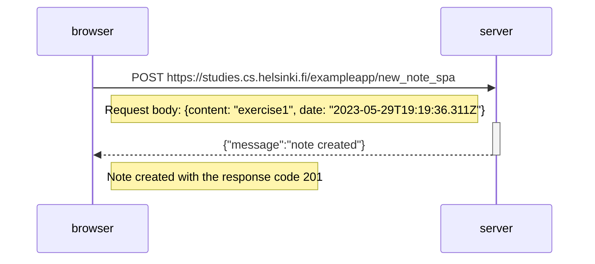

```mermaid
sequenceDiagram
    participant browser
    participant server

    browser->>server: POST https://studies.cs.helsinki.fi/exampleapp/new_note_spa
    Note right of browser: Request body: {content: "exercise1", date: "2023-05-29T19:19:36.311Z"}
    activate server
    server-->>browser: {"message":"note created"}
    deactivate server
    Note right of browser: Note created with the response code 201
```